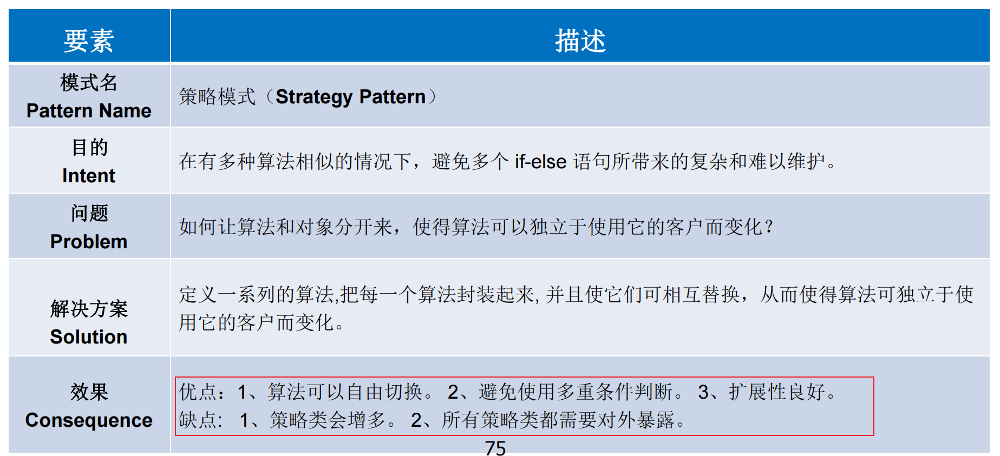
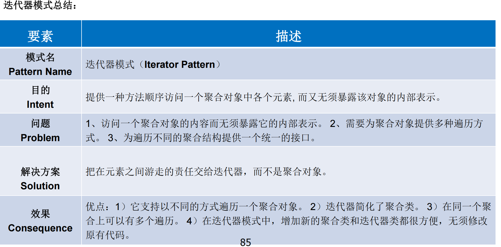

## 背多分

> 一般优缺点可从以下方面回答：
>
> - 复用性
> - 维护性
> - 扩展性
> - 灵活性
> - 效率性
> - 时间
> - 空间

#### 测试驱动开发优势：

① 强化对需求的理解，有助于从使用者的角度设计简单易用的接口。 

② 强化模块与接口的概念，促使我们实现松耦合的设计，并更多地依赖于接口，提高系统的可扩展性和抗变性。 

③ 频繁运行单元测试，尽量避免和尽早发现错误，极大地降低后续测试及修复的成本。 

④ 提供持续的回归测试，代码易于维护和重构。 

⑤ 可实时验证功能正确性的测试代码就是最好的代码文档，且与最新代码同步。 

⑥ 减轻压力、降低忧虑、提高我们对代码的信心，提高程序开发效率。

#### 软件构造的目标：

- 可理解性
- 可维护性
- 可复用性
- 时空性能

#### 面向对象的优点：

- 模块化
- 自然性
- 并发性
- 重用性
- （易维护
- （易扩展

面向对象方法使得软件具有良好的体系结构、便于软件构件化、软件复用和良好的扩展性和维护性，抽象程度高，因而具有较高的生产效率

优点：易维护、易复用、易扩展，由于面向对象有封装、继承、多态性的特性，可以设计出低耦合的系统，使系统 更加灵活、更加易于维护。面向对象技术具有程序结构清晰，自动生成程序框架，实现简单，可有效地减少程序的维护工作量，代码重用率高，软件开发效率高等优点

##### 面向对象技术在软件构造中的优势：

- 解耦
- 封装
- 复用
- 多态

#### 设计模式

其目的是为了提高代码的可重用性、代码的可阅读性和代码的可靠性

#### JVM特点：

- 一次编译，到处运行
- 自动内存管理
- 自动垃圾回收功能

#### JVM垃圾回收（隐式内存管理）

- 优点：

  - 对开发者屏蔽了内存管理的细节，提高了开发效率
  - 开发者无权操作内存，减少了内存泄漏的风险

- 缺点：

  - 不受控的垃圾回收会带来多余的时间开销

#### 对象与类的区别

- 对象：客观存在的具体实体，具有明确定义的状态（属性）和行为（方法）
- 类：对现实生活中一类具有共同属性和共同操作的对象的抽象
- 类是静态的，对象是动态的

#### 封装性优点：

- 安全性
- 高内聚：一种对象只做好一件事
- 低耦合：不同种类的对象的相互依赖尽可能降低
- 可复用性

#### 继承的好处：

- 提高程序的抽象程度
- 实现代码重用，提高开发效率和可维护性

##### 优点：

- 提高代码的可复用性，提高开发效率
- 提高程序的扩展性
- 使类与类之间产生了关系，构成了多态的基础

##### 缺点

- 让类的耦合性增强（一个类的改变会影响到其他相关类）

#### 抽象类的作用：

- 相当于定义了规范
- ==只能被继承==，保证子类实现其定义的抽象方法
- 可用于实现多态

#### 有抽象类，为什么还要接口？

- 抽象类解决不了多继承的问题
- 要实现的方法不是当前类的必要方法
- 为不同类型的多个类实现同样的方法

#### 多态的好处

- 减少耦合
- 增强可替换性
- 增强可扩展性
- 提高灵活性

##### 使用多态的三个必要条件

- 继承
- 重写
- 父类引用指向子类

##### 多态的三种实现方式

- 重写
- 抽象方法和抽象类
- 接口

#### 面向对象设计原则

- 单一职责原则：我就会干一件事，和这个没关系的别找我
- **开闭原则**：对扩展开放，对修改关闭（低耦合、易扩展、可复用）
- 里氏代换原则：一个软件实体如果使用的是一个基类的话，那么一定适用于其子类。即在软件里面，把基类都替换成它的子类，程序的行为没有变化（子类型、青出于蓝）
- 依赖倒转原则：高层模块不应该依赖低层模块，他们都应该依赖抽象，要针对接口编程，不要针对实现编程
- 合成复用原则：合成/聚合比继承更好。（继承会导致耦合度较高）
- 接口隔离原则：一个类对另一个类的依赖性应当是建立在最小的接口上。（接口尽可能划分得小一点，宁愿多继承接口）
- 迪米特法则：一个软件实体应当尽可能少的与其他实体发生相互作用（实际就是低耦合）

#### 单例模式（5）

#### 简单工厂模式VS工厂模式

#### 抽象工厂模式

#### 测试用例设计一般遵循以下原则： 

- 正确性。
- 全面性。
- 连贯性。
- 可判定性。
- 可操作性。

#### 白盒测试优势：

- 针对性强，可快速定位Bug 
- 函数级别，Bug修复成本低 
- 有助于了解测试的覆盖程度 
- 有助于优化代码，预防缺陷

劣势：

- 对测试人员要求高
- 成本高

#### 黑盒测试

优点：

- 方法简单有效 

- 可以整体测试系统行为 
- 开发与测试可以并行 
- 对测试人员技术要求相对较低

劣势：

- 入门门槛低

#### 代码质量

- 可维护性
- 可读性
- 可拓展性
- 可复用性
- 可测试性
- 简洁性

##### 如何提高代码质量

- 严格遵循编码规范 （阿里巴巴Java开发手册插件）
- 编写高质量的单元测试
- 代码审查 (Code Review) 
- 开发未动文档先行 
- 持续重构，重构，重构

#### 数组与集合

数组的长度是固定的，集合的长度是可变的；

数组是用来存放基本类型的数据，==集合用来存放对象的引用==；

#### 策略模式

一些补充：

- 策略模式的重心：不是如何实现算法，而是如何组织、调用算法。从而使程序结构==更灵活，具有更好的维护性和扩展性==。策略模式不决定何时使用何种算法（由客户端决定）
- 算法的平等性：各个策略算法平等，可相互替换
- 运行时策略的唯一性：策略模式在每一个时刻只能使用一个具体的策略实现对象
- 公有的行为：所有的策略类继承一个抽象类，可以将公有的行为放到抽象类中

##### 优点：

- 提供了一种替代继承的方法，而且==既保持了继承的优点（代码重用）还比继承更灵活（算法独立，可以任意扩展）==
- 把采取哪一种算法或采取哪一种行为的逻辑与算法本身分离，==避免程序中使用多重条件转移语句，使系统更灵活，并易于维护和扩展==
- 算法可以自由切换
- 扩展性良好u
- ==遵守大部分设计原则，高内聚、低耦合==

##### 缺点：

- 客户端必须知道所有的策略类，并自行决定使用哪一个策略类
- 由于策略模式把每个具体的策略实现都单独封装成为类，如果备选的策略很多的话， 那么对象的数目就会很可观。
- 所有策略类都需要对外暴露

##### 总结：

#### 迭代器模式

#### Dao模式优缺点

优点：

- 把低级的数据访问操作从高级的业务服务中**分离**出来
- 隔离数据层：新增了DAO层，不会影响到服务或者实体对象与数据库交互，发生错误会在该层进行异常抛出

缺点：

- 代码量增加（在实际中可忽略）

#### Runnable更常用，其优势：

- 任务与运行机制解耦，降低开销
- 更容易实现多线程资源共享
- 避免由于单继承局限带来的影响

#### 守护线程的唯一用途是为其他线程提供服务

#### 生产者消费者模式的好处：

- 并发（异步）：生产者和消费者各司其职，生产者和消费者都只需要关心缓冲区，不需要互相关注，通过异步的方式支持高并发， 将一个耗时的流程拆成生产和消费两个阶段
- 解耦：生产者和消费者进行解耦（通过缓冲区通讯）

#### 使用线程池的好处

#### 使用泛型的好处

- **不用强制转型**
- **在编译阶段检测到非法的数据类型**

#### 为什么需要通配符

**Object**是所有类型的父类，但是List\<Object>并不是list\<String>的父类

#### 类型参数T与通配符的区别

- T表示一个确定的类型，常用于泛型类和泛型方法的定义
- ？表示不确定的类型，不是类型变量，常用于泛型方法的调用代码和形参，==不能用于定义类和泛型方法==

#### 模板模式优缺点

#### 反射的优缺点

- 优点
  - 比较灵活，能够在运行时动态获取类的实例
- 缺点
  - 性能瓶颈：反射相当于一系列解释操作，通知JVM要做的事情，性能比直接的Java代码要**慢很多** 
  - 安全问题：反射机制**破坏了封装性**，因为通过反射可以获取并调用类的私有方法和字段。

#### 观察者模式的优缺点

