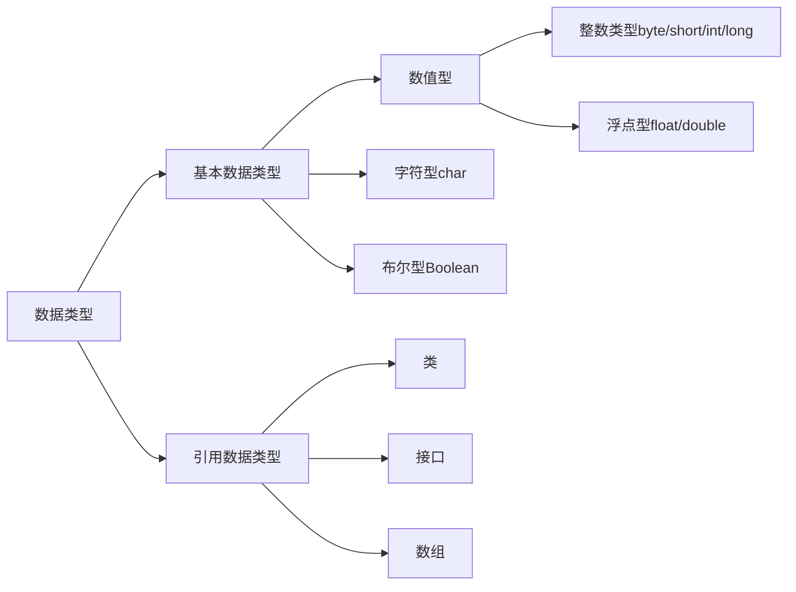

## 面向对象导论复习

### 第二章、java语言基础

> 2/5/7

#### 1.标识符、关键字、分隔符、注释

- 标识符：必须以英文字母（区分大小写）、下划线、美元符号$开头，==不能以数字开头==，不能与关键字同名
- 注释符
  - 行注释符
  - 块注释符
  - 文档注释符（通过Javadoc生产API文档）

#### 2. 基本数据类型，常量



- |  类型  | 字节  |
  | :----: | :---: |
  |  byte  |   1   |
  | short  |   2   |
  |  int   |   4   |
  |  long  | ==8== |
  | float  | ==4== |
  | double | ==8== |

- 浮点型常量默认是double，若要声明为float，需在数字末尾加 ‘ f ’ 或 ‘ F ’

- ```java
  float f = 3.14;	// 错误，doule不能赋值给float（需要强转）
  ```

##### （1）类型转换

- 数值类型转换

  - 低向高：自动类型转换

  - 高向低：强制类型转换（可能精度丢失）

    - ```java
      double b = 35.45000076293945;
      i = (int)b;	// 2147483647  即使b不大也会造成误差巨大
      ```

      

- 字符串转数字

  - ```java
    int x1 = Interger.parseInt("260");
    ```

  - ```java
    float f = Float.parseInt("23.5");
    double d = Double.parseInt("45.6");
    ```

##### （2）字符类型 char

- java的char类型是UTF-16 的code unit。（每个字符都有对应的Unicode码，直接用Unicode表示：'\uXXXX'，每个X表示一个16进制数）
- 转移字符

##### （3）布尔类型 boolean

- ==只允许用true和false==

##### （4）常量和变量

- 直接常量

- 符号常量

  - [修饰符]  ==final==  类型标识符  常量名[=常量]

  - ```java
    public final static double PI = 3.1415926535
    ```

- 变量

  - [修饰符]  类型标识符  变量名[=常量]

#### 3. 控制流程

条件、循环、跳转

```java
switch (表达式) {
		case 常量值1:
			break;
		case 常量值2:
			break;
		...
		
		default:
			break;
}
```

- 跳转：break；continue；return

#### 4. 输入输出

##### （1）输入

System.in是一个InputStream（字节输入流）类的对象，通常不直接使用它来读取用户键盘的输入。而是采取两种常用的封装方式：

-  使用字符流对System.in进行封装

  - ```java
    BufferedReader stdin = new BufferedReader(new InputStreamReader(System.in));
    String str = stdin.readline();
    ```

    

- 使用java.util.Scanner对System.in封装

  - ```java
    Scanner scan = new Scanner(System.in);
    int num = scan.nextInt();
    String str = scan.nextline();
    ```

##### （2）输出

System.out是一个PrintStream类对象，可调用print、println、write方法

print与println的区别在于末尾是否换行；write用来输出字节数组，不换行（网上说write是字符流？😵）


#### 5. 数组


##### （1）声明与创建

- ```java
  int[] a;
  或
  int a[];
  ```

- ``` java
  int[] c = new int[2];
  或
  int[] c = new int[]{0,1};
  ```

##### （2）长度

```java
int[] c = new int[2];
int len = c.length;
```


#### 6. 异常机制

##### try-catch-finally

- try：用于监听，将可能出现异常的代码放在try块内
- catch：用于捕获异常
- finally：==总会被执行==，只有finally块执行完成之后， 才会回来执行try或者catch块中的return或者throw语句，如果finally中使用了 return或者throw等终止方法的语句，则就不会跳回执行，直接停止。


##### throw和throws用法：

- 共同点：消极处理异常的方式，只负责抛出异常，真正处理异常由函数的上层调用处理
- ==区别==：
  - throws用于方法头，表示只是异常的声明，而throw用于方法内部，抛出的是异常对象
  - throws可以一次性抛出多个异常，而throw只能一个


#### 7. java虚拟机与垃圾回收

##### java虚拟机JVM

- JVM是通过软件来模拟java字节码的指令集，是java程序的运行环境
- 特点：
  - 一次编译，到处运行
  - 自动内存管理
  - 自动垃圾回收功能

- JVM体系结构
  - 


##### java堆

- 新生带
- 老年代
- 元空间（永久代）：像一些方法中的操作临时对象，使用物理内存（1.8之后）


##### JVM垃圾回收

- 不同于显示分配器，java使用隐式分配器，程序员只管创建对象使用，回收交给垃圾回收器

- 垃圾回收器在执行引擎中，垃圾回收的主要对象是==JVM堆空间==

- 优点：

  - 对开发者屏蔽了内存管理的细节，提高了开发效率
  - 开发者无权操作内存，减少了内存泄漏的风险

- 缺点：

  - 不受控的垃圾回收会带来多余的时间开销

  ==$JVM\subset JRE\subset JDK$==

  

### 第三章、类和对象

#### 1. 对象和类

面向对象三大特性：

- 封装
- 继承
- 多态


##### 对象与类的区别

- 对象：客观存在的具体实体，具有明确定义的状态（属性）和行为（方法）
- 类：对现实生活中一类具有共同属性和共同操作的对象的抽象
- 类是静态的，对象是动态的


#### 2. 类的声明和构造

类的修饰符：

- public 公共类
- abstract：抽象类
- final：最终类（非继承）
- 缺省时只能被同个包内的类访问和引用


##### 封装性：

- 将属性设置为private，通过getter/setter对属性进行访问
- 优点：
  - 安全性
  - 高内聚：一种对象只做好一件事
  - 低耦合：不同种类的对象的相互依赖尽可能降低
  - 可复用性


##### 构造方法：

- 无返回值；利用this关键字，区分私有变量和输入变量；
- 至少有一个，无定义时系统会产生一个默认构造方法


##### 继承、子类的构造方法

继承的好处：

- 提高程序的抽象程度
- 实现代码重用，提高开发效率和可维护性

子类通过super语句继承父类的构造方法


#### 3. 类的访问域（重要）


#### 4. static修饰符

##### 静态成员

> 包括静态属性和静态方法、静态块

静态成员随类的加载被静态地分配内存空间、方法地入口地址，不属于某一具体对象私有

- 使用static声明的方法，不能访问非static的属性或方法
- 使用非static声明的方法，可以分为static声明的属性和方法

##### 静态块

- 可以置于类中的任何地方，类中可以有多个static块
- 在类被加载的时候==执行且仅会被执行一次==，按照static块的顺序来执行每个static块
- 一般用来初始化静态属性和调用静态方法


#### 5. 数组

声明时一定要指出数组大小

- ```java
  int[] a;
  或
  int a[];
  ```

- ``` java
  int[] c = new int[2];
  或
  int[] c = new int[]{0,1};
  ```

一些注意点：

- ```java
  String[] names = {"HIT","SZ","C++"};
  String s = names[2];
  names[2] = "Java";
  System.out.println(s);	// C++
  ```

- > 

##### 遍历数组

```java
int[] ns = {1,23,4};
for(int i = 0; i<ns.length; i++){

}
// 或
for(int n : ns){
    
}
```

##### 一些方法

```java
Arrays.sort(ns);
Arrays.toString(ns);
```

##### 多维数组

> 从数组底层的运行机制看，没有多维数组

- 初始化

  - 静态初始化(行数一定要给)

    ```java
    int[][] arr = new int[m][n];
    int[][] arr = new int[m][]; //有m个一维数组，每个一维数组默认初始值为null
    int[][] arr = new int[][3];		// 非法
    ```

  - 动态初始化

    ```java
    int[][] arr = new int[][]{{1,2,3},{2,7},{4,5,6,7}};
    
    int[] x,y[];	//这里x是一维数组，y是二维数组
    ```

##### 对象数组

```java
// 声明
Person[] students;
// 或
Person students[];
// 初始化
Person[] students = new Person[2];
students[0] = new Person();
students[1] = new Person();
```


### 第四章、接口与继承

#### 1. 继承

- 利用extends关键字
- 子类不能直接继承父类的构造方法，需利用super关键字
- 子类能复用父类的属性和方法（权限允许即可），子类能增加一些新的属性和方法

##### 优点：

- 提高代码的可复用性
- 提高程序的扩展性
- 使类与类之间产生了关系，构成了多态的基础

##### 缺点

- 让类的耦合性增强（一个类的改变会影响到其他相关类）


#### 2. 接口与抽象类

##### 抽象类

> 简单说，有抽象方法的类就是抽象类
>
> ==抽象类不能实例化==
>
> ```java
> public abstract class Person{
> 	private String name;
> 	public String getName(){
> 		return name;
> 	}
>     // 抽象方法，没有方法体，用abstract做修饰
> 	public abstract void getMission();
> }
> ```

- 抽象类不能实例化
- 作用：
  - 相当于定义了规范
  - ==只能被继承==，保证子类实现其定义的抽象方法
  - 可用于实现多态

##### 接口

> 没有字段，所有方法都是抽象方法

```java
interface Persom{
	// 抽象方法
	void getDuty();
	void getMission();
}
```

- 当一个具体的class去实现一个interface时，使用implement关键字
- ==一个类可以implement多个interface，而只能extends一个抽象类==
- 若子类为非抽象类，则必须实现接口中的所有抽象方法

有抽象类，为什么还要接口？

- 抽象类解决不了多继承的问题
- 要实现的方法不是当前类的必要方法
- 为不同类型的多个类实现同样的方法


#### 3. 多态与重写

> 多态是同一行为具有多种表现形态的能力，程序中定义的变量和方法在编程时并不确定，而是在程序运行期间才确定。

##### 多态的好处

- 减少耦合
- 增强可替换性
- 增强可扩展1性
- 提高灵活性

##### 使用多态的三个必要条件

- 继承
- 重写
- 父类引用指向子类

##### 多态的实现

> 父类类名  引用名称  =  new  子类类名( );

- 重写

  - 在编译时，只能调用父类中声明的方法，但在运行时，实际执行的是子类重写父类的方法。（总结：左编译，右运行）

    >  

- 抽象类和抽象方法

  - > 

- 接口

  - > 


#### 4. Java多继承问题

#### 5. 超类与super关键字

#### 6. 异常的继承框架


### other

1. Reader 用于读入16位字符，也就是 Unicode 编码的字符；而 InputStream 用于读 入 ASCII 字符和二进制数据。 

2.  

   - 用 Scanner 实现字符串的输入有两种方法，一种是next（），一种nextLine()；
   - next() 一定要读取到有效字符后才可以结束输入，对输入有效字符之前遇到的空格键、Tab键或Enter键等结束符，next() 方法会自动将其去掉，只有在输入有效字符之后，next()方法才将其后输入的空格键、Tab键或Enter键等视为分隔符或结束符。
   - nextLine()方法的结束符只是Enter键。

   原文链接：https://blog.csdn.net/u011489043/article/details/65644104/