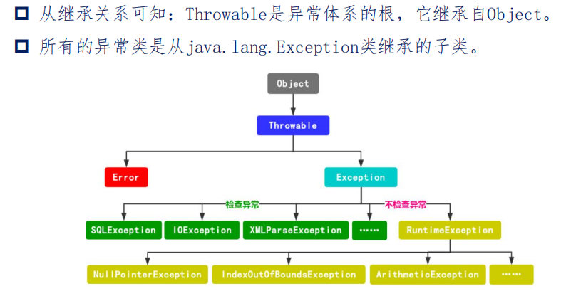
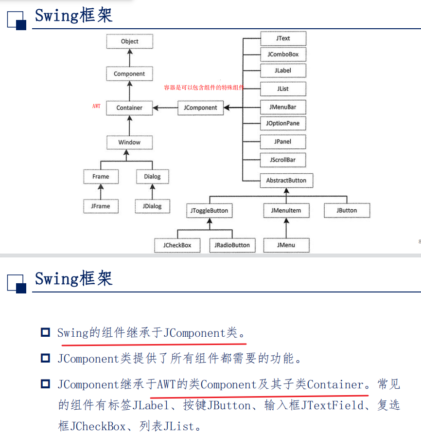
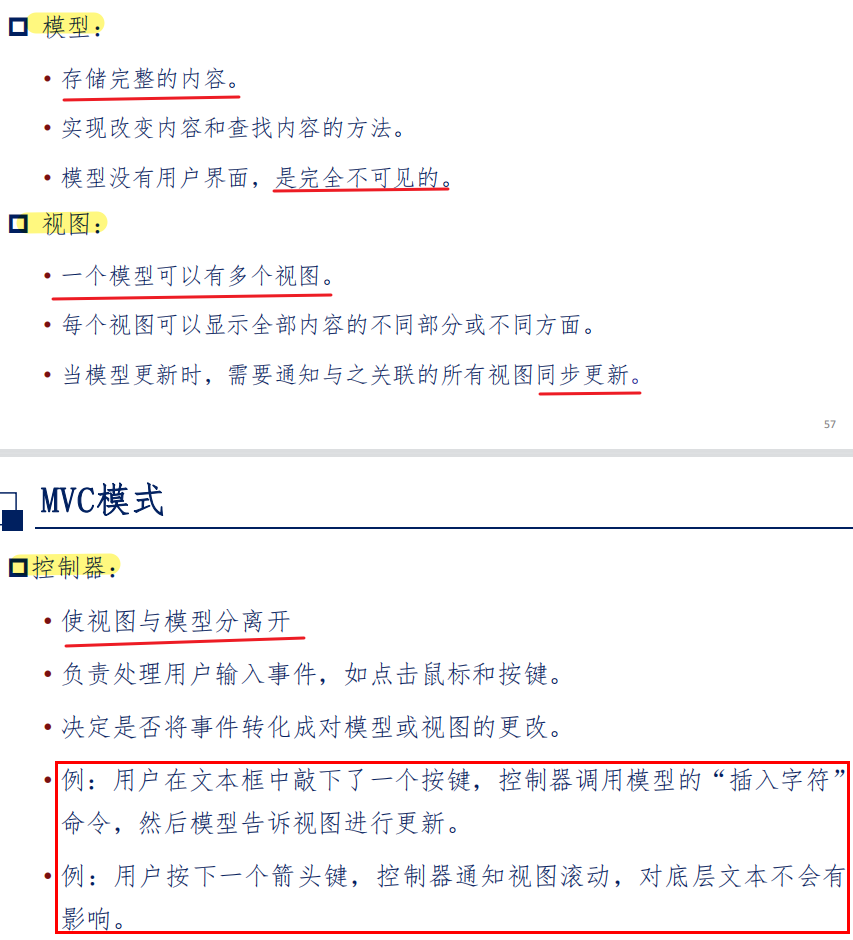
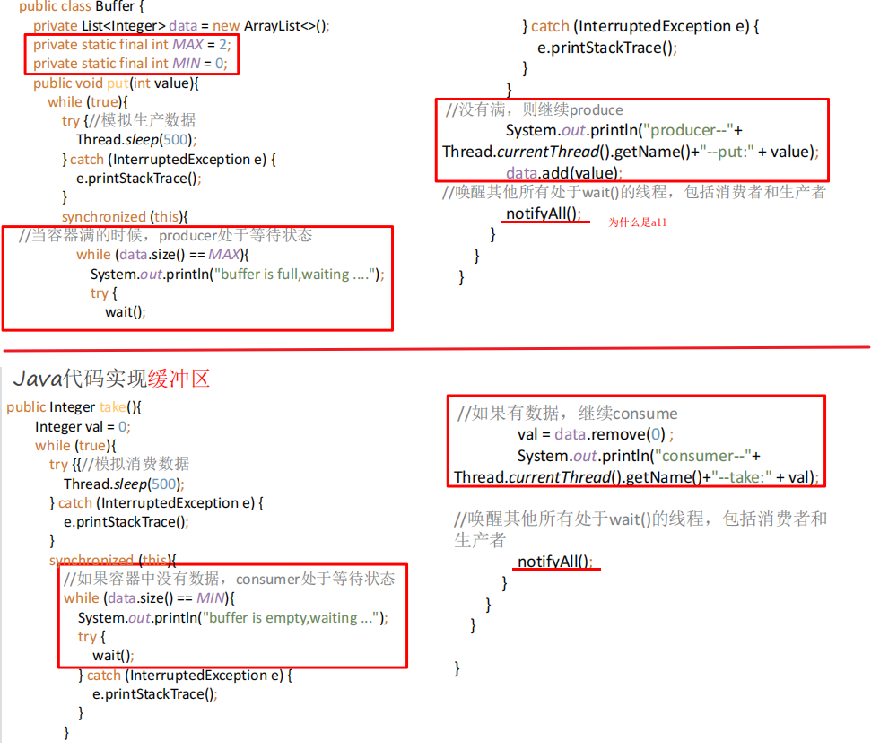
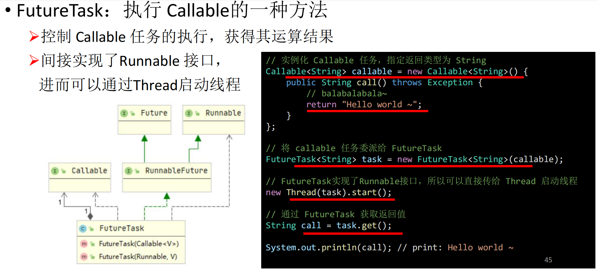

## 面向对象导论复习

### 第二章、java语言基础

> 2/5/7

#### 1.标识符、关键字、分隔符、注释

- 标识符：必须以英文字母（区分大小写）、下划线、美元符号$开头，==不能以数字开头==，不能与关键字同名
- 注释符
  - 行注释符
  - 块注释符
  - 文档注释符（通过Javadoc生产API文档）

#### 2. 基本数据类型，常量

```mermaid
graph LR
数据类型-->基本数据类型
数据类型-->引用数据类型
基本数据类型-->数值型
基本数据类型-->字符型char
基本数据类型-->布尔型Boolean
数值型-->整数类型byte/short/int/long
数值型-->浮点型float/double
引用数据类型-->类
引用数据类型-->接口
引用数据类型-->数组
```

- |  类型  | 字节  |
  | :----: | :---: |
  |  byte  |   1   |
  | short  |   2   |
  |  int   |   4   |
  |  long  | ==8== |
  | float  | ==4== |
  | double | ==8== |

- 浮点型常量默认是double，若要声明为float，需在数字末尾加 ‘ f ’ 或 ‘ F ’

- ```java
  float f = 3.14;	// 错误，doule不能赋值给float（需要强转）
  ```

##### （1）类型转换

- 数值类型转换

  - 低向高：自动类型转换

  - 高向低：强制类型转换（可能精度丢失）

    - ```java
      double b = 35.45000076293945;
      i = (int)b;	// 2147483647  即使b不大也会造成误差巨大
      ```

      

- 字符串转数字

  - ```java
    int x1 = Interger.parseInt("260");
    ```

  - ```java
    float f = Float.parseInt("23.5");
    double d = Double.parseInt("45.6");
    ```

##### （2）字符类型 char

- java的char类型是UTF-16 的code unit。（每个字符都有对应的Unicode码，直接用Unicode表示：'\uXXXX'，每个X表示一个16进制数）
- 转移字符

##### （3）布尔类型 boolean

- ==只允许用true和false==

##### （4）常量和变量

- 直接常量

- 符号常量

  - [修饰符]  ==final==  类型标识符  常量名[=常量]

  - ```java
    public final static double PI = 3.1415926535
    ```

- 变量

  - [修饰符]  类型标识符  变量名[=常量]

#### 3. 控制流程

条件、循环、跳转

```java
switch (表达式) {
		case 常量值1:
			break;
		case 常量值2:
			break;
		...
		
		default:
			break;
}
```

- 跳转：break；continue；return

#### 4. 输入输出

##### （1）输入

System.in是一个InputStream（字节输入流）类的对象，通常不直接使用它来读取用户键盘的输入。而是采取两种常用的封装方式：

-  使用字符流对System.in进行封装

  - ```java
    BufferedReader stdin = new BufferedReader(new InputStreamReader(System.in));
    String str = stdin.readline();
    ```

    

- 使用java.util.Scanner对System.in封装

  - ```java
    Scanner scan = new Scanner(System.in);
    int num = scan.nextInt();
    String str = scan.nextline();
    ```

##### （2）输出

System.out是一个PrintStream类对象，可调用print、println、write方法

print与println的区别在于末尾是否换行；write用来输出字节数组，不换行（网上说write是字符流？😵）


#### 5. 数组


##### （1）声明与创建

- ```java
  int[] a;
  或
  int a[];
  ```

- ``` java
  int[] c = new int[2];
  或
  int[] c = new int[]{0,1};
  ```

##### （2）长度

```java
int[] c = new int[2];
int len = c.length;
```


#### 6. 异常机制

##### try-catch-finally

- try：用于监听，将可能出现异常的代码放在try块内
- catch：用于捕获异常
- finally：==总会被执行==，只有finally块执行完成之后， 才会回来执行try或者catch块中的return或者throw语句，如果finally中使用了 return或者throw等终止方法的语句，则就不会跳回执行，直接停止。


##### throw和throws用法：

- 共同点：消极处理异常的方式，只负责抛出异常，真正处理异常由函数的上层调用处理
- ==区别==：
  - throws用于方法头，表示只是异常的声明，而throw用于方法内部，抛出的是异常对象
  - throws可以一次性抛出多个异常，而throw只能一个


#### 7. java虚拟机与垃圾回收

##### java虚拟机JVM

- JVM是通过软件来模拟java字节码的指令集，是java程序的运行环境
- 特点：
  - 一次编译，到处运行
  - 自动内存管理
  - 自动垃圾回收功能

- JVM体系结构
  - 


##### java堆

- 新生带
- 老年代
- 元空间（永久代）：像一些方法中的操作临时对象，使用物理内存（1.8之后）


##### JVM垃圾回收

- 不同于显示分配器，java使用隐式分配器，程序员只管创建对象使用，回收交给垃圾回收器

- 垃圾回收器在执行引擎中，垃圾回收的主要对象是==JVM堆空间==

- 优点：

  - 对开发者屏蔽了内存管理的细节，提高了开发效率
  - 开发者无权操作内存，减少了内存泄漏的风险

- 缺点：

  - 不受控的垃圾回收会带来多余的时间开销

  ==$JVM\subset JRE\subset JDK$==

  

### 第三章、类和对象

#### 1. 对象和类

面向对象三大特性：

- 封装
- 继承
- 多态


##### 对象与类的区别

- 对象：客观存在的具体实体，具有明确定义的状态（属性）和行为（方法）
- 类：对现实生活中一类具有共同属性和共同操作的对象的抽象
- 类是静态的，对象是动态的


#### 2. 类的声明和构造

类的修饰符：

- public 公共类
- abstract：抽象类
- final：最终类（非继承）
- 缺省时只能被同个包内的类访问和引用


##### 封装性：

- 将属性设置为private，通过getter/setter对属性进行访问
- 优点：
  - 安全性
  - 高内聚：一种对象只做好一件事
  - 低耦合：不同种类的对象的相互依赖尽可能降低
  - 可复用性


##### 构造方法：

- 无返回值；利用this关键字，区分私有变量和输入变量；
- 至少有一个，无定义时系统会产生一个默认构造方法


##### 继承、子类的构造方法

继承的好处：

- 提高程序的抽象程度
- 实现代码重用，提高开发效率和可维护性

子类通过super语句继承父类的构造方法


#### 3. 类的访问域（重要）


#### 4. static修饰符

##### 静态成员

> 包括静态属性和静态方法、静态块

静态成员随类的加载被静态地分配内存空间、方法地入口地址，不属于某一具体对象私有

- 使用static声明的方法，不能访问非static的属性或方法
- 使用非static声明的方法，可以分为static声明的属性和方法

##### 静态块

- 可以置于类中的任何地方，类中可以有多个static块
- 在类被加载的时候==执行且仅会被执行一次==，按照static块的顺序来执行每个static块
- 一般用来初始化静态属性和调用静态方法


#### 5. 数组

声明时一定要指出数组大小

- ```java
  int[] a;
  或
  int a[];
  ```

- ``` java
  int[] c = new int[2];
  或
  int[] c = new int[]{0,1};
  ```

一些注意点：

- ```java
  String[] names = {"HIT","SZ","C++"};
  String s = names[2];
  names[2] = "Java";
  System.out.println(s);	// C++
  ```

- > 

##### 遍历数组

```java
int[] ns = {1,23,4};
for(int i = 0; i<ns.length; i++){

}
// 或
for(int n : ns){
    
}
```

##### 一些方法

```java
Arrays.sort(ns);
Arrays.toString(ns);
```

##### 多维数组

> 从数组底层的运行机制看，没有多维数组

- 初始化

  - 静态初始化(行数一定要给)

    ```java
    int[][] arr = new int[m][n];
    int[][] arr = new int[m][]; //有m个一维数组，每个一维数组默认初始值为null
    int[][] arr = new int[][3];		// 非法
    ```

  - 动态初始化

    ```java
    int[][] arr = new int[][]{{1,2,3},{2,7},{4,5,6,7}};
    
    int[] x,y[];	//这里x是一维数组，y是二维数组
    ```

##### 对象数组

```java
// 声明
Person[] students;
// 或
Person students[];
// 初始化
Person[] students = new Person[2];
students[0] = new Person();
students[1] = new Person();
```


### 第四章、接口与继承

#### 1. 继承

- 利用extends关键字
- 子类不能直接继承父类的构造方法，需利用super关键字
- 子类能复用父类的属性和方法（权限允许即可），子类能增加一些新的属性和方法

##### 优点：

- 提高代码的可复用性
- 提高程序的扩展性
- 使类与类之间产生了关系，构成了多态的基础

##### 缺点

- 让类的耦合性增强（一个类的改变会影响到其他相关类）


#### 2. 接口与抽象类

##### 抽象类

> 简单说，有抽象方法的类就是抽象类
>
> ==抽象类不能实例化==
>
> ```java
> public abstract class Person{
> 	private String name;
> 	public String getName(){
> 		return name;
> 	}
>     // 抽象方法，没有方法体，用abstract做修饰
> 	public abstract void getMission();
> }
> ```

- 抽象类不能实例化
- 作用：
  - 相当于定义了规范
  - ==只能被继承==，保证子类实现其定义的抽象方法
  - 可用于实现多态

##### 接口

> 没有字段，所有方法都是抽象方法
>
> 可以有属性，但这个属性必须是一个public static final的常量

```java
interface Persom{
	// 抽象方法
	void getDuty();
	void getMission();
}
```

- 当一个具体的class去实现一个interface时，使用implement关键字
- ==一个类可以implement多个interface，而只能extends一个抽象类==
- 若子类为非抽象类，则必须实现接口中的所有抽象方法

有抽象类，为什么还要接口？

- 抽象类解决不了多继承的问题
- 要实现的方法不是当前类的必要方法
- 为不同类型的多个类实现同样的方法


#### 3. 多态与重写

> 多态是同一行为具有多种表现形态的能力，程序中定义的变量和方法在编程时并不确定，而是在程序运行期间才确定。

##### 多态的好处

- 减少耦合
- 增强可替换性
- 增强可扩展1性
- 提高灵活性

##### 使用多态的三个必要条件

- 继承
- 重写
- 父类引用指向子类

##### 多态的实现

> 父类类名  引用名称  =  new  子类类名( );

- 重写

  - 在编译时，只能调用父类中声明的方法，但在运行时，实际执行的是子类重写父类的方法。（总结：左编译，右运行）

    >  

- 抽象类和抽象方法

  - > 

- 接口

  - > 


#### 4. Java多继承问题

> - 内部类
> - 接口

##### 用内部类实现：

> 内部类具有外部类的所有元素的访问权限
>
> 实现多继承：相当于在一个类的内部声明多个类，这些内部类再分别继承别的类，且都可以获取各自父类的行为。
>
> 

##### 用接口实现

- 用一个接口继承多个接口，然后再用新建的类实现这个接口
- 直接新建一个类实现多个接口


#### 5. 超类与super关键字

##### Object超类

- Object是所有类的始祖，子类都可以使用Object的所有方法
- Object类位于Java.lang包中，编译时会自动导入
- 可以显示继承（extends Object），也可隐式继承（系统默认继承）

- 可以用Object类型的变量引用任何的对象。（可以理解为自动类型提升）

  - ```java
    Object obj = new Student("zhangsan",19);
    ```

  - 不过要对具体内容进行操作时，还需要进行强制类型转化（向下转型）

    - ```java
      Student Zhangsan = (Student)obj;
      ```

- equals方法

  - 用于比较两个对象是否相等，判断两个对象引用指向的是同一个对象

##### super关键字

- 显式地调用父类构造器（不利用super，也会隐式调用父类的空参构造器）
- 访问父类的成员方法和变量


#### 6. 异常的继承框架

> 异常：程序运行时不被期望的事件，它阻止了程序按照程序员的预期正常执行
>
> java内置了一套异常处理机制
>
> 异常是一种class

三种类型的异常

- 检查性异常：编译时不能被简单地忽略
- 运行时异常：是可能被程序员避免的异常，运行时异常可以在编译时被忽略
- 错误：错误不是异常，而是脱离程序员控制的问题。错误在代码中通常被忽略。如栈溢出

##### 


##### 设计自定义异常

- 所有异常类都必须是Throwable的子类
- 自定义一个检查性异常类，需要继承Exception类
- 自定义一个运行时异常类，需要继承RuntimeException类

> 
>
> 


### 第五章、设计模式导论

#### 1. 面向对象设计原则

- 单一职责原则：我就会干一件事，和这个没关系的别找我
- **开闭原则**：对扩展开放，对修改关闭（低耦合、易扩展、可复用）
- 里氏代换原则：一个软件实体如果使用的是一个基类的话，那么一定适用于其子类。即在软件里面，把基类都替换成它的子类，程序的行为没有变化（子类型、青出于蓝）
- 依赖倒转原则：高层模块不应该依赖低层模块，他们都应该依赖抽象，要针对接口编程，不要针对实现编程
- 合成复用原则：合成/聚合比继承更好
- 接口隔离原则：一个类对另一个类的依赖性应当是建立在最小的接口上
- 迪米特法则：一个软件实体应当尽可能少的与其他实体发生相互作用（实际就是低耦合）


#### 2. 设计模式

分类：

- 根据目的来分：
  - 创建型模式：主要特点是==将对象的创建与使用分离==（工厂模式、单例模式）
  - 结构型模式：用于描述如何将类或对象按某种布局组合成更大的结构行
  - 行为型模式：用于描述类或对象之间怎样==相互协作共同完成任务==（观察者模式、策略模式、迭代器模式）
- 根据范围来分
  - 类模式：用于处理类与子类的关系，这些关系通过继承来确立，是静态的，在编译时刻便确定下来
  - 对象模式：用于处理对象之间的关系，这些关系通过组合或聚合来实现，在运行时刻是可以变化的，更具多态性


#### 3. 单例模式

> 保证一个类仅有一个实例，并提供一个访问它的全局访问点。

让某个类==只有一个实例对象==，并只有一个取得该实例对象的方法

 --> 将构造器设置为private

 --> 只能通过类内部创建类的对象

 --> 由于外部不能实例化对象，只能调用该类的某个静态方法以返回类内部创建的对象 

--> 静态方法只能访问类中的静态成员变量，所以，指向类内部产生的该类对象的变量也必须定义成静态的

- 饿汉式：在声明静态变量时new一个实例对象，并通过静态方法返回

  - final：防止反射破坏单例

    饿汉式缺点：可能会造成内存空间的浪费

  - ```java
    public class Singleton{
        private static final Singleton instance = new Singleton();
        private Singleton(){}
        public static synchronized Singleton getInstance(){
            return instance;
        }
    }
    ```

    

- 懒汉式：在静态方法内new一个实例对象，并返回。多线程时可能发生问题

  - 解决：通过增加**synchronized**关键字到 getInstance() 方法中，迫使每个线程在进入这个方法之前， 要先等候别的线程离开该方法。也就是说， 不会有两个线程可以同时进入这个方法。但效率会比较低

  - ```java
    public class Singleton{
        private static Singleton instance;
        private Singleton(){}
        public static synchronized Singleton getInstance(){
            if(instance == null){
                instance = new Singleton();
            }
            return instance;
        }
    }
    ```

    

#### 4. 简单工厂模式

> 以pizza举例
>
> 不用简单工厂模式：创建pizza对象由pizzaStore控制，当要创建的pizza改变时，pizzaStore也要改变，不符合开闭原则
>
> 使用简单工厂模式：创建pizza对象由SimplePizzaFactory控制，只需在pizzaStore中创建SimplePizzaFactory并调用createPizza方法传入参数即可创建pizza对象，当要创建的pizza新增或删减时，只需改变SimplePizzaFactory，不需要改变pizzaStore，符合开闭原则

#### 5. 工厂模式


> 
>
> 
>
> 


#### 6.抽象工厂设计模式

产品族与产品等级

> 

新增产品族难，新增产品等级容易

> 
>
> 


### 第六章、软件测试及代码质量保障

[第六章](D:\JAVA\课上\第六章：软件测试及代码质量保障.pdf)

#### 1. 软件测试的定义和分类

软件测试：其目的在于校验被测系统是否满足需求，软件测试是以需求为中心，并非以缺陷为中心！


#### 2. 测试用例

测试用例设计一般遵循以下原则： 

- 正确性。
- 全面性。
- 连贯性。
- 可判定性。
- 可操作性。

#### 3. 白盒测试(结构测试)

也称作结构测试或逻辑驱动测试，它是基于程序的**源代码**，已知产品的内部工作过程，主要 是对程序内部结构展开测试，关注程序实现细节，==检验程序中的每条通路==是否都有按照预定要求 正确工作

优势：

- l 针对性强，可快速定位Bug 
- l 函数级别，Bug修复成本低 
- l 有助于了解测试的覆盖程度 
- l 有助于优化代码，预防缺陷

劣势：

- 对测试人员要求高
- 成本高


#### 4. 黑盒测试


### 第七章、集合与策略、迭代器模式

#### 1. 集合类概述

> java.util包中提供了一些集合类（容器）
>
> 数组的长度是固定的，集合的长度是可变的；
>
> 数组是用来存放基本类型的数据，==集合用来存放对象的引用==
>
> - 最基本的接口是Collection接口，该接口定义了操作数据的基本方法
> - 常用的集合有List集合、Set集合、Map集合，其中List与Set实现了Collection接口。各接口还提供了不同的实现类

#### 2. 集合的继承框架


尽管 Map 不是集合，但是它们完全整合在集合中

#### 3. List接口及其标准实现类ArrayList与LinkedList

##### List接口

> - List接口定义了一个==有序的对象集合==，允许重复元素存在，类似动态数组

##### ArrayList类

- 继承AbstractList，并实现List接口

- 需要引入java.util.ArrayList

- 与普通数组的区别就是它没有固定大小的限制

- ==增删改查==（主要通过索引）

  ```java
  import java.util.ArrayList	// 引入包
  
  public class ArrayListTest{
      public static void main(String[] args){
          ArrayList<String> sites = new ArrayList<String>();
          	// 添加
          	sites.add("Google");
          	sites.add("Taobao");
         		// 获取元素
          	System.out.println(sites.get(1));
          	// 修改元素
          	sites.set(1,"Wiki");
          	// 删除元素
          	sites.remove(1);
          	// 计算大小
          	System.out.println(sites.size());
          	// 迭代数组
          	// 通过for循环
          	for(int i = 0; i< sites.size();i++){
                  System.out.println(sites.get(i));
              }
          	// 通过迭代器
          	for(String i : sites){
                  System.out.println(i);
              }
      }
  }
  ```


##### LinkedList类

> ArrayList与LinkedList
>
> - 适合使用ArrayList：
>   - 频繁访问某一元素
>   - 只需对列表末尾进行添加或删除
> - 适合使用LinkedList
>   - 需要通过循环迭代来访问列表中某些元素
>   - 需要频繁在列表开头、中间、末尾等位置进行添加和删除元素操作
> - LinkedList分为单向链表和双向链表
> - 

使用：

- 需要引入Java.util.LinkedList包

- 也可使用集合创建链表？

- ```java
  import java.util.LinkedList	// 引入包
  
  public class LinkedListTest{
      public static void main(String[] args){
          LinkedList<String> sites = new LinkedList<String>();
          	// 添加（默认添加到末尾）
          	sites.add("Google");
          	sites.add("Taobao");
          	// 在列表开头添加元素
          	sites.addFirst("Wiki");
          	// 在列表中间添加元素
          	sites.add(1，"Wiki");
          	// 在列表末尾添加元素
          	sites.addLast("Wiki");
          	// 移除头部元素
          	sites.removeFirst();
         		// 移除尾部元素
          	sites.removeLast();
         		// 获取开头元素
          	System.out.println(sites.getFirst());
          	// 获取尾部元素
          	System.out.println(sites.getLast());
          	
          	
          	// 计算大小
          	System.out.println(sites.size());
          	// 迭代链表
          	// 通过for循环
          	for(int i = 0; i< sites.size();i++){
                  System.out.println(sites.get(i));
              }
          	// 通过迭代器
          	for(String i : sites){
                  System.out.println(i);
              }
      }
  }
  ```

- 在列表中间添加元素时，并不一定永远都是LinkedList比ArrayList快（因为为LinkedList在插入时需要先移动指针到指定 节点，才能开始插入），但在使用查询时一般选择ArrayList，进行删除和添加时选LinkedList


#### 4. Set与Map接口

##### set

- set集合中不能包含重复对象
- 

使用：

- 需要引入Java.util.HashSet包

- ```java
  import java.util.HashSet	// 引入包
  
  public class HashSetTest{
      public static void main(String[] args){
          HashSet<String> sites = new HashSet<String>();
          	// 添加元素
          	sites.add("Google");
          	sites.add("Taobao");
          	// 判断元素是否存在
          	System.out.println(sites.contains("Taobao"));
          	
         		// 移除元素
          	sites.remove("Taobao");
         		// 删除集合所有元素
          	sites.clear();
          	
          	// 计算大小
          	System.out.println(sites.size());
          	// 迭代HashSet
          	// 通过迭代器
          	for(String i : sites){
                  System.out.println(i);
              }
      }
  }
  ```

##### Map

> 一个key最多只能映射到一个值，但一个值可由多个key映射到
>
> 


- HashMap的key和value都可以是null（但最多只允许一条记录的键为null）
- Map的key和value都不允许是基本数据类型
- HashMap的key可以是==任意对象==
- 使用时需引入java.util.HashMap

```java
import java.util.HashMap	// 引入包

public class LinkedListTest{
    public static void main(String[] args){
        HashMap<Integer,String> sites = new HashMap<Integer,String>();
        	// 添加元素
        	sites.put(1,"Google");
        	sites.put(2,"Taobao");
        	// 访问元素
        	System.out.println(sites.get(2));
        	
       		// 移除元素,通过删除key来删除对应的键值对
        	sites.remove(2);
       		// 删除集合所有元素
        	sites.clear();
        	
        	// 计算大小
        	System.out.println(sites.size());
        	// 迭代HashSet
        	// 通过迭代器
        	// 输出key和value
        	for(Integer i : sites.keySet()){
                System.out.println("key:"+i+"value:"+sites.get(i));
            }
        	// 输出每一个value
        	for(String value : sites.values()){
                System.out.println(value+",";
            }
    }
}
```


#### 5. 策略模式

> 摆脱使用多个if-else

> 把每一个算法封装起来，使它们可以相互替换，将算法与客户独立开来。并将逻辑判断移到客户端

策略模式的三个角色：

- 环境角色：持有一个Strategy的引用。客户端在新建环境角色时，需以参数形式指定策略。同时需要有setStrategy()、executeStrategy()等方法。
- 抽象策略
- 具体策略

一些补充：

- 策略模式的重心：不是如何实现算法，而是如何组织、调用算法。策略模式不决定何时使用何种算法（由客户端决定）
- 算法的平等性：各个策略算法平等，可相互替换
- 运行时策略的唯一性：策略模式在每一个时刻只能使用一个具体的策略实现对象
- 公有的行为：所有的策略类继承一个抽象类，可以将公有的行为放到抽象类中

##### 优点：

- 提供了一种替代继承的方法，而且==既保持了继承的优点（代码重用）还比继承更灵活（算法独立，可以任意扩展）==
- 把采取哪一种算法或采取哪一种行为的逻辑与算法本身分离，==避免程序中使用多重条件转移语句，使系统更灵活，并易于维护和扩展==
- 算法可以自由切换
- 扩展性良好
- ==遵守大部分设计原则，高内聚、低耦合==

##### 缺点：

- 客户端必须知道所有的策略类，并自行决定使用哪一个策略类
- 由于策略模式把每个具体的策略实现都单独封装成为类，如果备选的策略很多的话， 那么对象的数目就会很可观。
- 所有策略类都需要对外暴露

#### 6. 迭代器模式

>在客户访问类 (如ArrayListTest) 与聚合类 (如ArrayList) 之间插入一个迭代器，这分离了聚合对象与其遍历行为，对客户也隐藏了其内部细节， 且满足“单一职责原则”和“开闭原则”。

- Java Iterator（迭代器）不是一个集合，它是一种用于==访问集合的方法==，可用于迭代 ArrayList 和 HashSet 等集合。 
- Iterator 是 Java 迭代器最简单的实现，ListIterator 是 Collection API 中的接口， 它扩展了 Iterator 接口

```java
import java.util.ArrayList	// 引入包
import java.util.Iterator	// 引入包

public class IteratorTest{
    public static void main(String[] args){
        
        // 创建集合
        ArrayList<String> sites = new ArrayList<String>();
        // 添加
        sites.add("Google");
        sites.add("Taobao");
        
       	// 获取迭代器
        Iterator<String> it = sites.iterator();
        // 输出集合第一个元素
        System.out.println(it.next());
        	
        // 循环集合元素
        while(it.hasNext()){
            System.out.println(it.next());
        }
    }
}
```

优点：

- 支持以不同的方式遍历一个聚合对象
- 迭代器简化了聚合类
- 在同一个聚合上可以有多个遍历
- 在迭代器模式中，增加新的聚合类和迭代器类都很方便，无限修改原有代码


### 第八章、流与输入输出

#### 1. 流

> 流（抽象）：流是一组有序的数据序列，将数据从一个地方带到另一个地方
>
> 按照流的方向分：输入流 输出流
>
> 按照数据单位不同分：字节流 字符流
>
> 按照功能分：节点流 处理流


#### 2. 输入输出流

系统流对应的类：java.lang.System

包含三个子类:

- System.in：标准输入流，默认设备是键盘
- System.out：标准输出流，默认设备是控制台
- System.err：标准错误流，默认设备是控制台


##### 从控制台读取多字符输入

- 使用字符流对System.in进行封装

  - ```java
    BufferedReader stdin = new BufferedReader(new InputStreamReader(System.in));
    String str;
    char c;
    // 读取字符,以q结束
    do{
        c = (char)stdin.read();
    }while(c!='q');
    
    // 读取字符串，以"end"结束
    do{
        str = stdin.readline();
    }while(!str.equals("end"));
    ```


##### 文件的输入输出

###### FileInputStream

- ```java
  InputStream f = new FileInputStream("C:/java/hello");
  ```

- ```java
  File f = new File("C:/java/hello");
  InputStream in = new FileInputStream(f);
  ```

###### FileOutputStream

- ```java
  OutputStream f = new FileOutputStream("C:/java/hello");
  ```

- ```java
  File f = new File("C:/java/hello");
  OutputStream fOut = new FileOutputStream(f);
  ```

##### 文件的输入输出实例

> 

#### 3. Java流继承框架

- IO流分类

  - 方向：input/reader,  output/writer
  - 数据：
    - 字节（8bit）：文本、图片、声音、视频等
    - 字符（16bit）：仅限纯文本

- Java中所有的流都位于java.io包中，都分别继承自一下四种抽象流家族

  |        |    字节流    | 字符流 |
  | :----: | :----------: | :----: |
  | 输入流 | IuputStream  | Reader |
  | 输出流 | OutputStream | Writer |

- 

- InputStream与OutputStream的层次结构

  

  

- Reader与Writer的层次结构

  

  常用子类：

  BufferedReader

  ```java
  BufferedReader in = new BufferedReader(new InputStreamReader(System.in));
  ```

  InputStreamReader/OutputStreamReader

  ```java
  InputStream = inputStream = new FileInputStream("D:\test");
  Reader inputStreamReader = new InputStreamReader(inputStream);
  ```

  

#### 4. 操作文件

> Paths和Files类

##### Paths

- 表示一个目录名序列，通过静态的get方法获得，可以是绝对路径也可以是相对路径

  ```java
  Path absolute = Paths.get("C:\data\myfile.txt");
  // Paths.get(basePath,relativePath);
  Path relative = Paths.get("myfile.txt");
  ```

##### 读写文件（Files类）

未指定编码格式时默认utf-8

###### 读

- ```java
  byte[] bytes = Files.readAllBytes(path);
  ```

- ```java
  String content = Files.readString(path,charset);// charset默认为utf-8
  ```

- ```java
  // 将文件当作行序列读入
  List<String> lines = Files.readAllines(path,charset);
  ```

###### 写

- Files有两个static的writeString方法

  ```java
  public static Path writeString(Path path, CharSequence csq, OpenOption... options) throws IOException		// 默认charset为utf-8
   
  public static Path writeString(Path path, CharSequence csq, Charset cs, OpenOption... options) throws IOException
  ```

- ```java
  Files.writeString(path,content,charset);
  // 追加内容
  Files.write(path,content.getBytes(charset),StandardOpenOption.APPEND);
  
  // 写入二进制文件: byte[] data = “abc”; 
  Files.write(Paths.get("/path/to/file.txt"), data); 
  // 写入文本并指定编码: 
  Files.writeString(Paths.get("/path/to/file.txt"), "文本内容...", StandardCharsets.ISO_8859_1); 
  // 按行写入文本: 
  List<String> lines = new ArrayList; lines.add(“abc”); Files.write(Paths.get("/path/to/file.txt"), lines);
  ```

##### 创建文件和目录

- 创建**新目录**可以调用： 
  - Files.creatDirectory(path); 
  - 其中，路径中==除了最后一个部件外，其他部分都必须是以存在的==。 
- 创建路径中的**中间目录**，可以调用:
  - Files.creatDirectories(path);
- 可以使用下面的语句创建一个**空文件**: 
  - Files.creatFile(path); 
  - 如果==文件已经存在了，那么这个调用就会抛出异常==。

##### 复制、移动和删除文件

> 

##### 获取文件信息

> 


#### 5. 对象输入/输出与序列化

> 序列化：把对象转换为字节序列的过程称为对象的序列化
>
> 反序列化：把字节序列恢复为对象的过程称为对象的反序列化

##### 对象序列化步骤如下： 

- 创建一个==对象输出流（java.io.ObjectOutputStream）==，它可以包装一个其他类型的目标输出流，如文件输出流； 

- 通过对象输出流的writeObject()方法写对象；

- ```java
  ObjectOutputStream oos = new ObjectOutputStream(new FileOutputStream("person.dat")); 
  oos.writeObject(p1);
  ```

##### 对象**反序列化步骤**如下： 

- 创建一个对象输入流，它可以包装一个其他类型的源输入流，如文件输入流； 

- 通过对象输入流的readObject()方法读取对象；

- ```java
  ObjectInputStream ois = new ObjectInputStream(new FileInputStream("person.dat")))
  
  Person zhangsan = (Person) ois.readObject()
  ```

  

#### 6. 数据访问对象模式

> Dao模式用于把低级的数据访问操作从高级的业务服务中分离出来
>
> Dao的各参与者：
>
> - 数据访问对象接口
> - 数据访问对象实体类（实现上述接口，数据源可以是数据库、xml、等等）
> - 模型对象/数值对象

优点：

- 隔离数据层：新增了DAO层，不会影响到服务或者实体对象与数据库交互，发生错误会在该层进行异常抛出

缺点：

- 代码量增加（在实际中可忽略）


### 第九章、Swing图形用户界面

> 1/5
>
> [第九章、Swing图形用户界面](D:\JAVA\课上\第九章-swing介绍v7.pdf)

#### 1. Swing框架

> Swing是构建在AWT架构之上，AWT提供了窗口工具的底层机制，如事件处理；Swing提供了更加强大的用户界面组件，如绘制的用户界面类
>
> Swing GUI包含了两种元素：**组件和容器**。
>
> 容器也是组件，因此容器也可以放到别的容器中

> 


##### 布局管理器

> 布局管理器控制这容器中组件的位置
>
> 不使用布局管理器则需设置好组件间的距离，再向容器添加

> 


#### 2. Swing图形处理、绘制颜色的原理

##### 显示窗体

> 顶层窗口（==没有包含在其它窗口中的窗口==）称为窗体
>
> 描述窗体的类：JFrame （扩展了AWT中的Frame库）
>
> JFrame不绘制在Swing组件上，（按钮、标题栏、图标等）由用户的窗口系统控制

所有Swing组件必须由事件分派线程（event dispatch thread）配置，这是控制线程，它将鼠标点击和按键等事件传递给用户接口组件。

> ```java
> frame.setSize(300,200);
> frame.serDefaultCloseOperation(JFrame.EXIT_ON_CLOSE);
> frame.setVisible(true);
> ```

##### 显示信息（自定义组件）


##### 绘制2D图形

```java
class DrawComponent extends JComponent{ 
	public static final int DEFAULT_WIDTH = 400;
	public static final int DEFAULT_HEIGHT = 400;
    public void paintComponent(Graphics g){
        // 获得Graphics2D类的一个对象
    	var g2 = (Graphics2D) g;
        double leftX = 100; 
        double topY = 100; 
        double width = 200; 
        double height = 150; 
        
        var rect = new Rectangle2D.Double(leftX,topY,width,height);
        // 设置画笔颜色
        g2.setPaint(Color.RED);
        // g2.setPaint(new Color(124,223,123));
        //绘制矩形
        g2.draw(rect); 
        // 颜色填充
       	// g2.fill(rect);
	}
    public Dimension getPreferredSize(){
        return new Dimension(DEFAULT_WIDTH,DEFAULT_HEIGHT);
    }
}
```

##### 显示图像

```java
public void paintComponent(Graphics g) 
{
    int X = 100;
    int Y = 100; 
    Image image = new ImageIcon(path).getImage(); 
    g.drawImage(image, X, Y, null); 
}
```

复制粘贴平铺

```java
public void paintComponent(Graphics g) 
{ 
	int X = 0; 
	int Y = 0;
	Image image = new ImageIcon(path).getImage(); 
	g.drawImage(image, X, Y, null); //在左上角显示图像的一个副本 
	int imageWidth = image.getWidth(null); 
	int imageHeight = image.getHeight(null); 
    for(int i = 0; i*imageWidth <= getWidth(); i++) 
    	for(int j = 0; j*imageHeight <= getHeight(); j++) 
        	if(i+j > 0) 
            	g.copyArea(0,0,imageWidth,imageHeight, 
            				i*imageWidth,j*imageHeight);
    			// 第一、二个参数表示原始图像位置；第三、四个参数表示原始图像宽高；
    			// 第五、六个参数表示粘贴图像的位置
}
```


#### 3. 事件机制

三类对象：

- 事件：用户对组件的一次操作
- 事件源：事件发生的场所，通常就是==各组件==
- 事件监听器：实现了监听接口的类实例

==一个事件源可以有多个监听器==


步骤：

- 声明事件源
- 声明监听器
- 事件源添加监听器
  - 这样用户一操作，事件源就会创建一个ActioEvent对象，并传入listener.actionPerformed(event)中

##### 按钮实例


简洁方式

```java
exitButton.addActionListener(event->System.exit(0));
// 或

public void makeButton(String name,Color backgroundColor){
    var button = new Jbutton(name);
    button.addActionListener(event->
          buttonPanel.setBackground(backgroundColor));
}
public BottonFrame2() 
{ 
    setSize(DEFAULT_WIDTH,DEFAULT_HEIGHT); 
    buttonPanel = new JPanel(); 
    add(buttonPanel); 
    makeButton("yellow", Color.YELLOW); 
    makeButton("blue", Color.BLUE); 
    makeButton("red", Color.RED); 
    makeButton(“green", Color.Green); 
}
```


#### 4. Swing基本用户组件

##### 文本输入

> - 文本域（JTextField）：接受单行文本
>
>   - 改变文本域中的内容 setText()
>   - 获取用户键入的文本
>   - trim()：去掉文本域内容前后的空格
>
> - 文本区（JTextArea）：接受多行文本
>
>   - 可以输入多行文本，用回车键换行，每行以\n结尾
>
>   - 构造时，可以指定文本区的行数和列数
>
>   - JTextArea本身没有滚动条，若需要，可将文本去放在scrollPane中
>
>     ```java
>     var textArea = new JTextArea(ROWS,COLUMNS);
>     var scrollPane = new JScrollPane(textArea);
>     ```
>
>     
>
> - 密码域（JPasswordField）：接受单行文本，且不显示文本内容
>
>   - 每个输入的字符由回显字符（echo character，如*）表示
>   - char[] getPassword()：密码不是以String返回

##### 标签和标签组件

标签是容纳文本的组件，没有任何修饰，不能响应用户输入

```java
new JLabel("User Name:",SwingConstants.RIGHT);// 指定初始文本和图标，及内容的排列方式
```

##### 选择组件

> 复选框：每一个要么选中要么没选中
>
> 单选框：多选一
>
> 组合框：多选一（下拉选择）


组合框


菜单


#### 5. MVC模式

组件三特征：内容、外观、行为

模型-视图-控制器




### 第十章、多线程

> 3

#### 1. 进程与线程

- 进程：正在运行的程序
  - 私有空间，彼此隔离
  - ==每个进程仿佛拥有整台计算机的资源==
  - ==多进程之间不共享内存==
  - 进程之间通过消息传递进行协作
  - 一般：进程==程序\==应用（应用也可能包含多个进程）
- 线程：进程中的单个顺序控制流，是一条执行路径
  - 操作系统能运算调度的最小单位
  - 包含在进程中，是进程的实际运作单位
  - 一个进程可以包含（并发）多个线程
  - 一个进程至少包含一个线程
  - 多个线程之间共享内存
- 

#### 2. 多线程

==共享内存，不共享寄存器与堆栈==

#### 3. java中对线程的控制

##### 多线程的实现方式

> 方式1：定义一个类继承Thread类并重写run方法
>
> ```java
> public class Thread1 extends Thread{
> 	@override
> 	public void run(){
> 		System.out.println("New Thread");
> 	}
> }
> public class Main{
>     public static void main(String[] args){
>         new Thread1.start();
>     }
> }
> ```
>
> 方式2：实现Runnable接口（更常用）
>
> ```java
> public class Thread2 implements Runnable{
> 	@override
> 	public void run(){
> 		System.out.println("New Thread");
> 	}
> }
> public class Main{
>     public static void main(String[] args){
>         new Thread(new Thread2()).start();
>     }
> }
> ```
>
> ```java
> public class Main{
>     public static void main(String[] args){
>         Thread t = new Thread(()->{
>             System.out.println("New Thread");
>         });
>         t.start();
>     }
> }
> ```
>
> 

> 不能直接调用run方法，而是start方法
>
> run()方法只是类的一个普通方法而已，如果直接调用run方法，程序中依然只有主线程这一个线程，其程序执行路径还是只有一条，还是要顺序执行。还是要等待run方法体执行完毕后才可继续执行下面的代码，这样就没有达到写线程的目的。

##### Runnable更常用，其优势：

- 任务与运行机制解耦，降低开销
- 更容易实现多线程资源共享
- 避免由于单继承局限带来的影响

##### 终止线程

线程会由于以下两个原因之一而终止：

- run方法正常退出
- 因为==一个没有捕获的异常==终止了run方法，使线程意外终止

stop已弃用

- 调用stop方法会终结线程，抛出ThreadDeath错误对象，由此杀死线程。只能试图终止一个给定线程，而没有线程的互操作


##### 线程的状态


##### 中断线程


##### 线程优先级


##### 守护线程


> ==守护线程的唯一用途是为其他线程提供服务==

##### 线程相关方法


#### 4. 同步、死锁及如何避免

##### 线程同步

> - 如果多个线程同时读写共享变量，会出现数据不一致的问题
> - 原子操作：指不能被中断的一个或一系列操作。即要么完全执行，要么完全不执行，不存在执行了一半的情况
> - 多线程下，要保证逻辑正确，对共享变量读写时，==必须保证一组指令以原子方式执行：即某一个线程执行时，其他线程必须等待==
> - 
>
> ```java
> class AddThread extends Thread{
> 	public void run(){
>         for(int i = 0;i<1000; i++){
>             synchronized(Counter.lock){
>                 Counter.count +=1;
>             }
> 		}
>     }
> }
> class DecThread extends Thread{
> 	public void run(){
>         for(int i = 0;i<1000; i++){
>             synchronized(Counter.lock){
>                 Counter.count -=1;
>             }
> 		}
>     }
> }
> ```

##### 线程死锁

> 

例子（代码展示）

```java
public class Thread18 {
    public static void main(String[] args) {
        Object lockA = new Object();
        Object lockB = new Object();
 
        Thread t1 = new Thread(() -> {
            // 1.占有一把锁（锁A）
            synchronized (lockA) {
                System.out.println("线程1：获得锁A。");
                // 休眠 1s(让线程2有时间先占有锁B)
                try {
                    TimeUnit.SECONDS.sleep(1);
                } catch (InterruptedException e) {
                    e.printStackTrace();
                }
                // 2.获取线程2的锁B
                synchronized (lockB) {
                    System.out.println("线程1：获得锁B。");
                }
            }
        });
        t1.start();
 
        Thread t2 = new Thread(() -> {
            // 1.占有一把锁（锁B）
            synchronized (lockB) {
                System.out.println("线程2：获得了锁B！");
                // 休眠1s（保证线程1能有充足的时间得到锁A）
                try {
                    TimeUnit.SECONDS.sleep(1);
                } catch (InterruptedException e) {
                    e.printStackTrace();
                }
                // 2.获取线程1的锁A
                synchronized (lockA) {
                    System.out.println("线程2：获得了锁A！");
                }
            }
        });
        t2.start();
 
    }
}
```

避免死锁：==线程获取锁的顺序要一致==

#### 5. 多线程应用——生产者与消费者模式

[第十章、多线程](D:\JAVA\课上\第十章：多线程v7.pdf)


问题：

- 如何保证缓存区中数据的一致性
- 如何保证消费者和生产者之间的同步和协作关系

方案：

- 加同步锁
- 利用线程内部直接的通信（Object的wait() / notify()  方法）

实现：




> Java中要求wait方法为什么要放在同步块中：==防止出现 Lost Wake-Up==。（notifyAll先于wait执行，导致无法唤醒，https://blog.csdn.net/GTH07399/article/details/123252741）
>
> 为什么缓冲区的判断条件是 while(condition) 而不是 if(condition)：==防止线程被错误地唤醒==。（一个被唤醒的线程就处于就绪状态了，就可以等待被cpu调度了，但是在if语句中，线程被唤醒就从被唤醒的地方执行，不会再次判断，而在while循环中，从被唤醒的地方开始执行代码，至始至终都在while循环中，会继续判断，不满足情况就跳出while，满足就继续wait [多线程下为什么用while代替if判断](https://blog.csdn.net/Alphr/article/details/105581952?spm=1001.2101.3001.6661.1&utm_medium=distribute.pc_relevant_t0.none-task-blog-2~default~CTRLIST~default-1-105581952-blog-80321137.pc_relevant_default&depth_1-utm_source=distribute.pc_relevant_t0.none-task-blog-2~default~CTRLIST~default-1-105581952-blog-80321137.pc_relevant_default&utm_relevant_index=1)）

生产者消费者模式的好处：

- 并发（异步）：生产者和消费者各司其职，生产者和消费者都只需要关心缓冲区，不需要互相关注，通过异步的方式支持高并发， 将一个耗时的流程拆成生产和消费两个阶段
- 解耦：生产者和消费者进行解耦（通过缓冲区通讯）

#### 6. 任务与线程池

##### 任务：


> 用Runnable和Callable都无法完成需要的功能
>
> 可利用==FutureTask==，实现Runnable接口，构造函数传入Callable对象。Callable对象中的call方法会在FutureTask中实现的Runnable接口中的run方法被调用，最后通过FutureTask中的get方法获得call方法中的返回值（对象类型）
>
> 
>
> 
>
> 小扩展：
>
> 

##### 线程池：


> 即：先创建线程，以逸待劳
>
> 线程池继承关系：
>
> Executor：接口
>
> ExecutorService：接口继承Executor，做了shutdown()等
>
> AbstractExecutorService：实现ExecutorService接口的大部分方法
>
> ThreadPoolExecutor：线程池的核心实现类


### 第十一章、泛型与反射

[泛型与反射](D:\JAVA\课上\第十一章：泛型与反射v3.pdf)

#### 1. 什么是泛型、为什么需要泛型

> 为ArrayList设定类型，能在编译阶段检测到非法的数据类型

#### 2. 泛型类、泛型方法、泛型接口

##### 泛型类

> 先不确定一个类中的某些属性的类型，在实例化时再确定。
>
> ==声明泛型不能是基本数据类型==
>
> 

##### 泛型方法

> 泛型方法可以定义在泛型类中，也可以定义在普通类中
>
> 只有声明泛型的方法才是泛型方法

- 非泛型类中声明

  ```java
  class GenericFun{ 
  	public <T,E> void fun1(E e){} 
  	public <T> T fun2(T t)
  	{ 
  		return t; 
  	} 
  }
  //调用泛型方法时，在方法名前的尖括号中填入具体类型。 
  GenericFun g = new GenericFun(); 
  g.<String>fun2("str") ); 
  //多数情况下，方法调用可以!!!省略!!!类型参数。 
  g.fun2(“str”) );//返回值为str
  ```

- 泛型类中声明

  ```java
  class GenericFun<K>{ 
  	public <T> T fun2(T t,K k){
      	return null; 
      } 
  }
  //使用泛型方法，此处传入参数必须与泛型类声明的类型一致 
  GenericFun<Integer> g = new GenericFun<>(); 
  g.fun2("str1",123) ;
  ```

- 如果泛型方法的泛型与泛型类声明的泛型名称一致，则泛型方法中的 泛型会覆盖类的泛型

  ```java
  class GenericFun<K>{ 
  	public <T,K> T fun2(T t, K k){
      	return null; 
      } 
  }
  //使用泛型方法，此时类的泛型为Integer，泛型方法传入的参数为两个String 
  GenericFun<Integer> g = new GenericFun<>(); 
  g.fun2("str1","str2") ;
  ```

- 类的静态泛型方法，不得使用泛型类中声明的泛型，可以独立声明

  > 
  >
  > 

##### 泛型接口

```java
interface GenericInterface <T>{ 
    T fun1(); 
}
```

- 实现类为非泛型类，需==具体指定接口的泛型==

  > 

- 实现类为泛型类，实现类的泛型要与接口==一致==

  > 

#### 3. 泛型的通配符

为什么需要通配符

> 

应用：

> 

- <? extends ClassName>：类型参数是ClassName的子类。（**上界通配符**）
- <? super ClassName>：类型参数是ClassName的超类。（**下界通配符**）
- <?>：无限定通配符

参数类型T与通配符：

- T表示一个确定的类型，常用于泛型类和泛型方法的定义
- ？表示不确定的类型，不是类型变量，常用于泛型方法的调用代码和形参，==不能用于定义类和泛型方法==

#### 4. 泛型的设计——模板方法模式

模板方法模式：

- 定义一个操作中的算法骨架 
- 将一些步骤延迟到子类中 
- 模板方法模式使得子类可以不改变一个算法的结构即可重新定义该算法的某些特定步骤


AbstractClass抽象类 

- 抽象模板，定义并实现了一个模板方法 
- 给出顶层逻辑的骨架 

ConcreteClass具体类 

- 实现父类定义的一个或多个抽象方法 


一个抽象类可以有任意多个具体子类 

每一个具体类都可以给出抽象方法的不同实现


好处：

- 把不变的行为搬到子类，去除子类中的重复代码
- 提高了代码的复用
- 应用情况：一次性实现算法的不变部分，并将可变的部分留给子类来实现


参与者：抽象类和具体类

协作：

- 具体类靠抽象类实现算法中的==不变步骤==
- 抽象类靠具体类实现算法的==具体细节==


#### 5. 反射

> 

##### Class类


##### 获取Class类对象

- 通过对象名：Object.getClass()：返回一个Class类型的实例
- 通过类名：Class.forName()：传入一个字符串参数（com.bmw.Student），返回一个Class类型
- 通过数据类型：T.class：T是任意的Java类型（可能是类也可能不是类）。返回一个Class类型

##### 通过反射构造类的实例

- 方法一：使用Class.newInstance

  - newInstance方法==调用默认的构造函数（无参）==初始化新创建的对象

  - 若这个类没有默认的构造函数，就会抛出一个异常

  - ```java
    Date data1 = new Date();
    Class class = Date.getClass();
    Date date2 = class.newInstance();
    ```

- 方法二：使用Constructor的newInstance

  - 通过反射获取构造方法再调用

  - 先获取构造函数，再执行构造函数

  - 

  - ```java
    public class ConTest { 
        public static void main(String[] args) { 
            Student Harry = new Student("Harry Potter", 11); 
            Class StudentClass = Harry.getClass(); 
            Constructor con = StudentClass.getConstructor(String.class, int.class); 
            con.setAccessible(true);
            Student Ron = (Student)con.newInstance("Ron Weasley", 11); 
            System.out.println(Ron); 
        } 
    }
    ```

##### 通过反射获取和修改成员变量

- 

- ```java
  public class FieldTest { 
      public static void main(String[] args) { 
          Student Harry = new Student("Harry Potter", 11); 
          Class StudentClass = Harry.getClass(); 
          Field f = StudentClass.getDeclaredField("name"); 
          f.setAccessible(true); 
          Object v1 = f.get(Harry); // get和set方法都要指定要操作的对象的名
          System.out.println(v1); 
          f.set(Harry,"The boy who lived"); 
          System.out.println(Harry.getName()); 
      } 
  }// 调用f.set(Harry, newValue)可以修改harry对象的name属性为newValue中的值
  ```

##### 通过反射获取成员方法


##### 反射的优缺点

- 优点
  - 比较灵活，能够在运行时动态获取类的实例
- 缺点
  - 性能瓶颈：反射相当于一系列解释操作，通知JVM要做的事情，性 能比直接的Java代码要**慢很多** 
  - 安全问题：反射机制**破坏了封装性**，因为通过反射可以获取并调用类的私有方法和字段。

#### 6. 设计安全的全局单例

> 

```java
public class Singleton { 
    private static Singleton singleton = new Singleton(); 
    private Singleton(){ 
        if(singleton != null) { 
            throw new RuntimeException(“单例构造器禁止通过反射调用");
        } 		
	}
    public static Singleton getInstance(){ 
        return singleton; 
    } 
}
```


### 第十二章、网络编程

[第十二章、网络编程](D:\JAVA\课上\第十二章-改(2).pdf)

#### 1.网络通信的基本原理及IP地址

> - 
> - IP地址分5类，给不同的人或机构用
>
> - 域名系统（DNS）
>   - ​	一个完整的域名一般为：计算机主机名.本地名.组名.最高层域名
>   - 百度  域名：www.baidu.com     IP：112.80.248.74
> - 

#### 2.Socket编程类库

> Socket（套接字）是一个抽象概念，它是使用了**TCP协议**的通信机制。套接字使 用TCP提供了两台计算机之间的通信机制，允许程序员把网络连接当成一个流 （Stream）。**客户端**程序创建一个套接字，并尝试连接**服务器**的套接字
>
> Socket由一个端口号（应用程序）和一个IP地址（计算机）唯一确定
>
> 涉及3个类：ServerSocket、Socket、InetAddress

**ServerSocket** 有四种构造方法： 

- **1. public ServerSocket(int port)** 
  - 创建绑定到特定端口的服务器套接字。 
- **2. public ServerSocket(int port, int backlog)** 
  - 利用指定的 backlog 创建服务器套接字并将其绑定到指定的本地端口号。 
- **3. public ServerSocket(int port, int backlog, InetAddress address)** 
  - 使用指定的端口、侦听 backlog 和要绑定到的本地 IP 地址创建服务器。 
- **4. public ServerSocket()** 
  - 创建非绑定服务器套接字。

**Socket** 有五种构造方法： 

- **1. public Socket(String host, int port) throws UnknownHostException, IOException** 
  - 创建一个流套接字并将其连接到指定主机上的指定端口号。 
- **2. public Socket(String host, int port) throws IOException** 
  - 创建一个流套接字并将其连接到指定主机上的指定端口号。 
- **3. public Socket(String host, int port, InetAddress localAddress, int localPort)** 
  - 创建一个套接字并将其与指定远程主机上的指定远程端口连接。 
- **4. public Socket(InetAddress host, int port, InetAddress localAddress, int localPort)** 
  - 创建一个套接字并将其与指定远程主机上的指定远程端口连接。 
- **5. public Socket()** 
  - 通过系统默认类型的 SocketImpl 创建未连接套接字


> 
>
> 
>
> 


#### 3.URL的使用

URL: Uniform Resource Locator, 统一资源定位符。用于从主机上读取资源 （==只能读取，不能向主机写==）

一个URL地址通常由4部分组成： 

- 协议名：如http、ftp、file等 
- 主机名：如baidu、220.181.112.143等 
- 途径文件：如/java/index.jsp 
- 端口号：如8080、8081等

> 


##### 创建URL类的对象

- public URL(String str)

  ```java
  URL myurl = new URL( “http://www.edu.cn” );
  ```

- public URL(String protocol, String host, String file)

  ```java
  URL myurl = new URL(“http”, “www.edu.cn”, “index.html”);// 端口使用缺省值
  ```

- public URL(String protocol, String host, String port, String file)

  ```java
  URL myurl = new URL(“http”, “www.edu.cn”, “80”, “index.html”);
  ```

- public URL(URL content, String str)

  ```java
  URL mynewurl = new URL(myurl, “setup/local.html”);//给出了一个相对于content的路径偏移量
  ```


#### 4.观察者模式

- 观察者模式(Observer Pattern)：定义对象间的一种**一对多**依赖关系，使得每 当一个对象状态发生改变时，其相关依赖对象皆得到通知并被自动更新。 
- 观察者模式又叫做发布-订阅（Publish/Subscribe）模式、模型-视图 （Model/View）模式、源-监听器（Source/Listener）模式或从属者 （Dependents）模式 
- 观察者模式是一种对象行为型模式

> 

##### 优缺点


具体层之间可能会存在关联或依赖关系，在一定程度上违反了开闭原则


### other

1. Reader 用于读入16位字符，也就是 Unicode 编码的字符；而 InputStream 用于读 入 ASCII 字符和二进制数据。 

2.  

   - 用 Scanner 实现字符串的输入有两种方法，一种是next（），一种nextLine()；
   - next() 一定要读取到有效字符后才可以结束输入，对输入有效字符之前遇到的空格键、Tab键或Enter键等结束符，next() 方法会自动将其去掉，只有在输入有效字符之后，next()方法才将其后输入的空格键、Tab键或Enter键等视为分隔符或结束符。
   - nextLine()方法的结束符只是Enter键。

   原文链接：https://blog.csdn.net/u011489043/article/details/65644104/