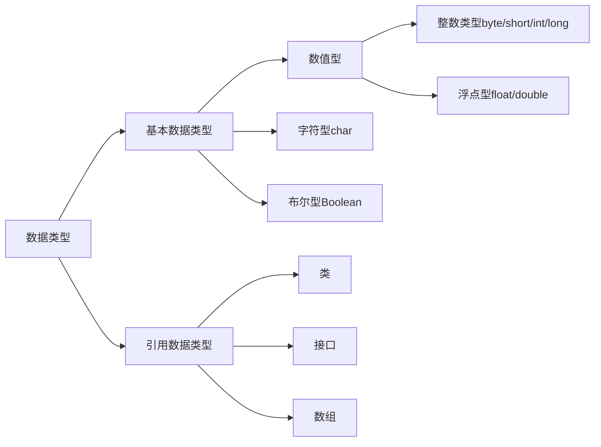
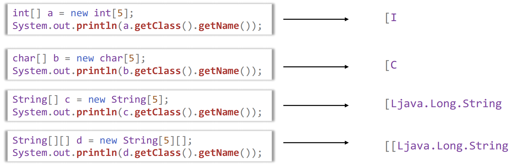

## 面向对象导论复习

### 第二章、java语言基础

#### 1.标识符、关键字、分隔符、注释

- 标识符：必须以英文字母（区分大小写）、下划线、美元符号$开头，==不能以数字开头==，不能与关键字同名
- 注释符
  - 行注释符
  - 块注释符
  - 文档注释符（通过Javadoc生产API文档）

#### 2. 基本数据类型，常量



- |  类型  | 字节  |
  | :----: | :---: |
  |  byte  |   1   |
  | short  |   2   |
  |  int   |   4   |
  |  long  | ==8== |
  | float  | ==4== |
  | double | ==8== |

- 浮点型常量默认是double，若要声明为float，需在数字末尾加 ‘ f ’ 或 ‘ F ’

- ```java
  float f = 3.14;	// 错误，doule不能赋值给float（需要强转）
  ```

##### （1）类型转换

- 数值类型转换

  - 低向高：自动类型转换

  - 高向低：强制类型转换（可能精度丢失）

    - ```java
      double b = 35.45000076293945;
      i = (int)b;	// 2147483647  即使b不大也会造成误差巨大
      ```

      

- 字符串转数字

  - ```java
    int x1 = Interger.parseInt("260");
    ```

  - ```java
    float f = Float.parseInt("23.5");
    double d = Double.parseInt("45.6");
    ```

##### （2）字符类型 char

- java的char类型是UTF-16 的code unit。（每个字符都有对应的Unicode码，直接用Unicode表示：'\uXXXX'，每个X表示一个16进制数）
- 转移字符

##### （3）布尔类型 boolean

- ==只允许用true和false==

##### （4）常量和变量

- 直接常量

- 符号常量

  - [修饰符]  ==final==  类型标识符  常量名[=常量]

  - ```java
    public final static double PI = 3.1415926535
    ```

- 变量

  - [修饰符]  类型标识符  变量名[=常量]

#### 3. 控制流程

条件、循环、跳转

```java
switch (表达式) {
		case 常量值1:
			break;
		case 常量值2:
			break;
		...
		
		default:
			break;
}
```

- 跳转：break；continue；return

#### 4. 输入输出

##### （1）输入

System.in是一个InputStream（字节输入流）类的对象，通常不直接使用它来读取用户键盘的输入。而是采取两种常用的封装方式：

-  使用字符流对System.in进行封装

  - ```java
    BufferedReader stdin = new BufferedReader(new InperStreamReader(System.in));
    String str = stdin.readline();
    ```

    

- 使用java.util.Scanner对System.in封装

  - ```java
    Scanner scan = new Scanner(System.in);
    int num = scan.nextInt();
    String str = scan.nextline();
    ```

##### （2）输出

System.out是一个PrintStream类对象，可调用print、println、write方法

print与println的区别在于末尾是否换行；write用来输出字节数组，不换行（网上说write是字符流？😵）


#### 5. 数组



##### （1）声明与创建

- ```java
  int[] a;
  或
  int a[];
  ```

- ``` java
  int[] c = new int[2];
  或
  int[] c = new int[]{0,1};
  ```

##### （2）长度

```java
int[] c = new int[2];
int len = c.length;
```


#### 6. 异常机制

##### try-catch-finally

- try：用于监听，将可能出现异常的代码放在try块内
- catch：用于捕获异常
- finally：==总会被执行==，只有finally块执行完成之后， 才会回来执行try或者catch块中的return或者throw语句，如果finally中使用了 return或者throw等终止方法的语句，则就不会跳回执行，直接停止。


##### throw和throws用法：

- 共同点：消极处理异常的方式，只负责抛出异常，真正处理异常由函数的上层调用处理
- ==区别==：
  - throws用于方法头，表示只是异常的声明，而throw用于方法内部，抛出的是异常对象
  - throws可以一次性抛出多个异常，而throw只能一个


#### 7. java虚拟机与垃圾回收

##### java虚拟机JVM

- JVM是通过软件来模拟java字节码的指令集，是java程序的运行环境


### other

1. Reader 用于读入16位字符，也就是 Unicode 编码的字符；而 InputStream 用于读 入 ASCII 字符和二进制数据。 

2.  

   - 用 Scanner 实现字符串的输入有两种方法，一种是next（），一种nextLine()；
   - next() 一定要读取到有效字符后才可以结束输入，对输入有效字符之前遇到的空格键、Tab键或Enter键等结束符，next() 方法会自动将其去掉，只有在输入有效字符之后，next()方法才将其后输入的空格键、Tab键或Enter键等视为分隔符或结束符。
   - nextLine()方法的结束符只是Enter键。

   原文链接：https://blog.csdn.net/u011489043/article/details/65644104/